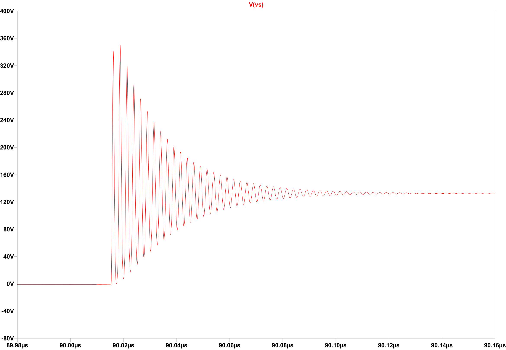
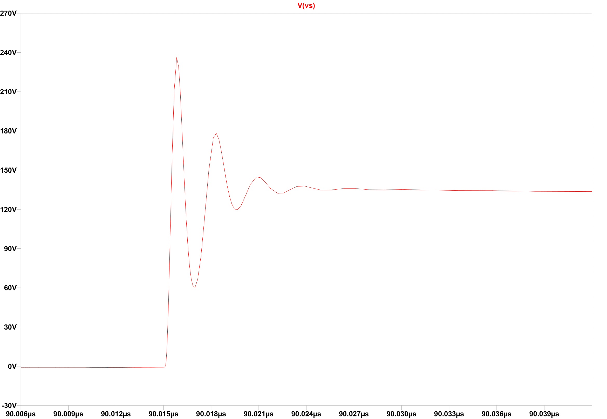

# ⚡ Dual-Stage Power Converter: AC-DC Rectification & Regulated DC-DC Buck

**Course:** Power Electronics Laboratory  
**University:** University of Bologna, Cesena Campus  
**Academic Year:** 2023/2024  

---

## 📌 Project Overview

This repository documents the comprehensive analysis, design, and simulation of a **Two-Stage Power Converter**. The system transforms a variable AC input into a highly regulated DC output, specifically tailored to power an essential electronic load.

The design features a **rectifier front-end** followed by a **controlled DC-DC Buck converter** with dynamic feedback, ensuring optimal efficiency and output stability despite input voltage fluctuations.

**Project Objectives**

1. Convert a nominal AC supply of **$110 \ V_{RMS}$ (±10%)** into a stable DC voltage.  
2. Regulate the final output voltage to a target of **$V_{o} = 48 \ V$**.  
3. Implement a dynamic **Driver and Feedback** system to maintain output voltage stability against input variation and parasitic losses.  
4. Mitigate switching transients using a custom-designed **RC Snubber** circuit.  

**Design Specifications (Summary)**

| Parameter                                | Value                      | Notes                                                  |
| :--------------------------------------- | :------------------------- | :----------------------------------------------------- |
| **Input AC Voltage** ($V_{in, AC}$)      | $110 \ V_{RMS}$ (±10%)     | Input range from $99 \ V_{RMS}$ to $121 \ V_{RMS}$.    |
| **Output DC Voltage** ($V_{o}$)          | $48 \ V$                   | Target regulated voltage.                              |
| **Max Output Current** ($I_{o, max}$)    | $8.33 \ A$                 | Corresponds to a $400 \ W$ load.                       |
| **Switching Frequency** ($f_{sw}$)       | $100 \ kHz$                | Buck stage operating frequency (CCM).                  |
| **Output Ripple**                        | < 1% of $V_{o}$ (ideal)    | Target ripple reduction.                               |
| **Maximum Efficiency** ($E_{ff}$)        | ≈ 91%                      | Achieved under specific conditions.                    |


The full laboratory report detailing theoretical calculations, component sizing, and simulation results can be found here: ➡️ **[Download Dual-Stage Converter Project Report (EN)](Dual_Stage_Converter_Project_Report.pdf)**

---

## 🛠️ Tools and Software Used

### Software

* **LTspice:** For schematic capture, transient analysis, component model integration, and Snubber tuning.
* **LaTeX:** For professional preparation and formatting of the technical report.

### Websites

* **Mouser Electronics:** For component selection

### Key Components Selected (Final Circuit)

| Component                    | Model             | Spec                                                       |
| :--------------------------- | :---------------- | :--------------------------------------------------------- |
| **MOSFET**                   | **STP34NM60N**    | $V_{DS} = 600 \ V$, $I_D = 31.5 \ A$                       |
| **Diode**                    | **VS-ETU1506**    | $I_F = 15 \ A$, $V_f = 1.1 V @ I_F = 15 \ A$               |
| **Full Bridge Rectifier**    | **GBUE2560**      | $I_F = 55 \ A$, $V_f = 0.75 V @ I_F = 12.5 \ A$            |
| **Op-Amp**                   | **AD8030ARZ**     | High-speed operational amplifier for the feedback loop.    |


---

## 📊 Key Simulation Results and Optimization

The simulation confirmed the feasibility of the design while accounting for non-ideal effects.

### 1. Transient Suppression with RC Snubber

An RC Snubber ($R_{SNB} = 47 \ \Omega$, $C_{SNB} = 75 \ pF$) was implemented to protect the MOSFET.

| Condition | Peak Switching Voltage | Ringing Duration |
| :--- | :--- | :--- |
| **Without Snubber** | $\approx 360 \ V$ | $\approx 120 \ ns$ |
| **With Snubber** | $\approx 240 \ V$ | $\approx 10 \ ns$ |

The snubber significantly reduced transients, improving component reliability.

<p float="left">
  
  
</p>


| Image 1 | Image 2 |
|---------|---------|
|  |  |


 &nbsp; 


### 2. Output Regulation and Efficiency

The closed-loop feedback system dynamically adjusts the **Duty Cycle ($D$)** to maintain $V_o = 48 \ V$, compensating for input variation and internal losses.

| Case | Input DC Voltage ($V_d$) | Calculated $D$ | Adjusted $D$ | Measured $V_{out}$ | Measured $E_{ff}$ |
| :--- | :--- | :--- | :--- | :--- | :--- |
| **Low Input** | $140 \ V$ | $0.342$ | $0.363$ | $48.0298 \ V$ | $91.27\%$ |
| **High Input** | $171.12 \ V$ | $0.28$ | $0.2855$ | $48.076 \ V$ | $87.74\%$ |

### 3. Continuous Conduction Mode (CCM) Verification

The inductor current ($I_L$) never drops to zero, confirming the correct sizing of $L = 27 \ \mu H$ and ensuring operation in **CCM** under full load conditions.


---

## 🗂️ Repository Structure

The project files are organized to separate the documentation, schematics, and components.

```
Dual-Stage-Power-Converter/
│
├─ Dual_Stage_Converter_Project_Report.pdf            # Final project report (EN)
├─ LICENSE                                            # MIT License
├─ README.md                                          # This file
├─ Simulations/
│   ├─Buck_Converter.asc
│   ├─Buck_Converter_With_Snubber.asc
│   ├─ Driver_and_Feedback_Stage.asc
│   ├─  Final_Circuit.asc
│   ├─ Final_Circuit_With_Driver_and_Feedback.asc    # The complete two-stage system 
│   ├─   Full_Wave_Rectifier.asc
│   ├─    Half_Wave_Rectifier.asc   
│   └─ Components/
│       ├─ GBUE2560.txt
│       ├─ STP20NM60.lib
│       ├─ STP34NM60N.lib
│       ├─ VS-ETH3007.txt
│       └─ VS-ETU1506.txt
└─ Images/
    ├─ 
    ├─ 
    ├─
    └─ 
```

---

## 📜 License

The source code and simulation files in the `Simulations/` folder are released under the **MIT License**.

The technical report (`Dual_Stage_Converter_Project_Report.pdf`) is licensed under **CC BY 4.0** (Creative Commons Attribution 4.0 International).
